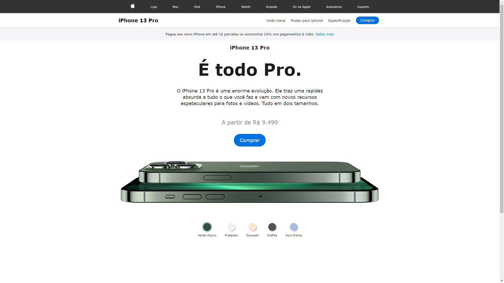

# Clone do iPhone 13 Pro

Este é um clone simples da página inicial do iPhone 13 Pro, desenvolvido com HTML, CSS e JavaScript. O projeto é voltado para fins educacionais e práticos, proporcionando uma oportunidade de aprendizado sobre desenvolvimento web básico e responsivo.

 

## Imagem do projeto

 

## Como Usar

<ol>
<li>Faça o download ou clone este repositório.</li>
<li>Abra o arquivo index.html em seu navegador.</li>
</ol>

 

## Estrutura do Projeto

<ul>
<li>HTML (index.html): Contém a estrutura básica da página, incluindo a barra de navegação, informações do produto e seleção de cores.</li>
<li>CSS (style.css): Define o estilo visual da página, incluindo o layout responsivo e a aparência dos elementos</li>
<li>JavaScript (index.js): Adiciona funcionalidades interativas à página, permitindo a troca dinâmica de imagens ao selecionar diferentes opções de cores.</li>
</ul>

 

## Aprendizados

Ao explorar este projeto, você pode aprender os seguintes conceitos.

<ol>
<h2><li>HTML</li></h2>
<ul>
<li>Estruturação básica de uma página web.</li>
<li>Uso de tags semânticas como header, nav, main, e footer.</li>
<li>Inclusão de imagens e links.</li>
</ul>
<h2><li>CSS</li></h2>
<ul>
<li>Estilização de elementos e aplicação de classes.</li>
<li>Implementação de um layout responsivo usando consultas de mídia (@media).</li>
<li>Utilização de transições para efeitos visuais suaves.</li>
</ul>
<h2><li>JavaScript</li></h2>
<ul>
<li>Seleção de elementos do DOM usando document.querySelector e document.querySelectorAll.</li>
<li>Manipulação de classes CSS para adicionar/remover estilos dinamicamente.</li>
<li>Uso de eventos (click) para interatividade do usuário.</li>
<li>Carregamento dinâmico de imagens com base nas escolhas do usuário.</li>
</ul>
<ol>

## Responsividade

O projeto é responsivo e adapta-se a dispositivos móveis com largura de tela de até 480 pixels, garantindo uma experiência amigável em diferentes tamanhos de tela.

 

## Autor
Este projeto foi desenvolvido por mim através de um curso da Udemy.